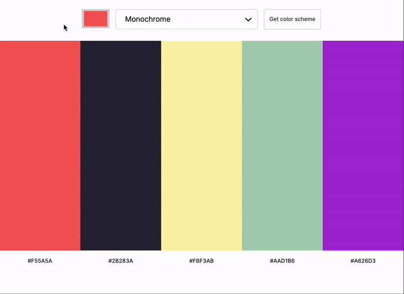

# Color Scheme Generator

Color Scheme Generator uses The Color API to get a color scheme based on a single seed color and specified mode. Each color is displayed along with the corresponding hex code. Other functionality include copy-to-clipboard feature to make it easier to

## Table of contents

- [Overview](#overview)
  - [The challenge](#the-challenge)
  - [Demo](#demo)
  - [Links](#links)
- [My process](#my-process)
  - [Built with](#built-with)
  - [What I learned](#what-i-learned)
  - [Continued development](#continued-development)
  - [Useful resources](#useful-resources)
- [Conventions](#conventions)
- [Author](#author)

## Overview

### The challenge

Users should be able to:

- Select a seed color with the color picker, choose a mode (Monochrome, etc.), and generate a color scheme after clicking button to get color scheme.
- Display the scheme colors and hex values.
- Stretch goal (completed): Copy the hex code to the clipboard

### Demo


### Links
- Live Site URL: [https://blog.jeffeng.com/color_scheme_generator/](https://blog.jeffeng.com/color_scheme_generator/)

## My process

### Built with

- Semantic HTML5 markup
- Vanilla JavaScript
- CSS custom properties
- Flexbox
- CSS Grid
- [The Color API](https://www.thecolorapi.com/)

### What I learned

The main objective of this project was to learn how to use ```fetch``` to interact with an API, make GET requests and display the data returned from the API.
```js
function fetchColorScheme(url) {
    // Make fetch request to Color API
    fetch(url)
        .then(response => response.json())
        .then(data => {
            renderColors(data.colors);
        })
        .catch(err => console.error(err));
}
```

With the help of Web Dev Simplified, I was able to implement a custom Select dropdown by creating a Select class.
```js
export default class Select {
    constructor(element) {
        this.element = element;
        this.options = getFormattedOptions(element.querySelectorAll('option'));
        this.customElement = document.createElement('div');
        this.labelElement = document.createElement('span');
        this.iconElement = document.createElement('i');
        element.style.display = 'none';
        this.optionsCustomElement = document.createElement('ul');
        setupCustomElement(this);

        element.after(this.customElement);
    }

    get selectedOption() {
        return this.options.find(option => option.selected);
    }

    get selectedOptionIndex() {
        return this.options.indexOf(this.selectedOption);
    }

    selectValue(value) {
        const newSelectedOption = this.options.find(option => {
            return option.value === value;
        });
        const previousSelectedOption = this.selectedOption;
        previousSelectedOption.selected = false;
        previousSelectedOption.element.selected = false;

        newSelectedOption.selected = true;
        newSelectedOption.element.selected = true;

        this.labelElement.innerText = newSelectedOption.label;

        this.optionsCustomElement
        .querySelector(`[data-value="${previousSelectedOption.value}"]`)
        .classList.remove('selected');
        this.optionsCustomElement
        .querySelector(`[data-value="${newSelectedOption.value}"]`)
        .classList.add('selected');

    }
}
```
During this project, I was also able to implement a notification to copy the hex code to clipboard. CSS animations are an area of opportunity for practice:
```css
@keyframes notification {
    0% {
        opacity: 0%;
    }

    15% {
        opacity: 100%;
        bottom: 30vh;
    }

    80% {
        opacity: 100%;
        bottom: 30vh;
    }

    100% {
        opacity: 50%;
    }
}
}
```

### Continued development

#### Future improvements include:
- Dark mode
- Accessibility improvements
- Layouts for smaller screens
- Displaying the color name provided by the API


### Useful resources

- [Throttle](https://blog.webdevsimplified.com/2022-03/debounce-vs-throttle/) - I was looking for a way to throttle the user from fetching a color scheme on every button click. The throttle function delays subsequent fetches until after a cooldown period.
- [Custom Select Dropdown](https://youtu.be/Fc-oyl31mRI?si=l7MPmX_l1LUFLr8b) - This YouTube video helped me implement the custom select dropdown instead of using the browser default.

### Conventions
* BEM (Block__Element--Modifier) naming convention for CSS classes
    * _Block_: `palette`
    * _Element_: `bar`
    * _Modifier_: `active`
    * _**Example**_:
        ```html
        <ul class="grid palette" id="palette">
            <li class="palette__bar--active" data-bar="0" data-hex-code="#F55A5A" aria-label="Color: #F55A5A">
                <i class="fa-regular fa-clone copy"></i>
            </li>
        </ul>
        ```  

## Author

- Portfolio Site - [Jeff Eng](https://www.jeffeng.com)
- X (formerly Twitter) - [@elev8eng](https://www.twitter.com/elev8eng)